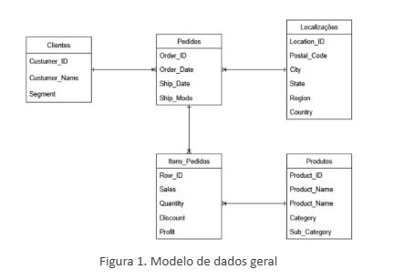
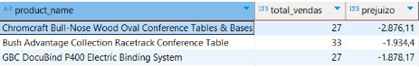
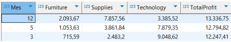
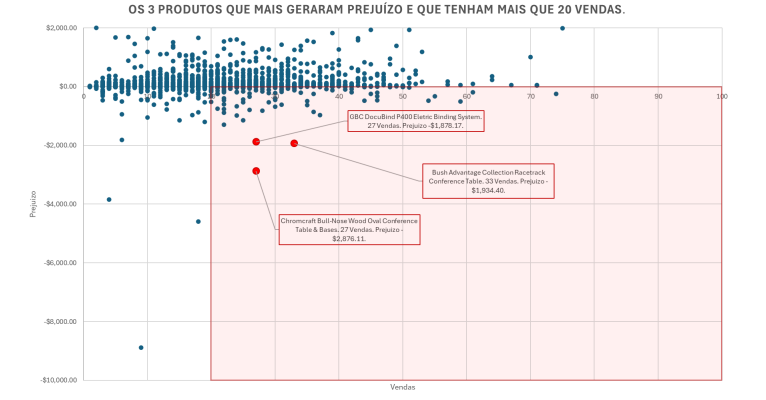

# 📊 Superstore Sales Analysis: A Multi-Paradigm Data Approach
**SQL | Cassandra | Neo4j**

## 📌 Project Overview
This project transforms raw global sales data from a "Superstore" dataset into actionable business intelligence. The core objective was to design and implement a robust data architecture across three different database paradigms to solve critical business challenges regarding profitability, customer behavior, and regional logistics.

While the project explores NoSQL technologies for scalability and connectivity, the **primary focus is on SQL (MySQL)** for high-precision financial reporting and relational integrity.

---

## 🏗️ Data Architecture & Modeling
To ensure a "Single Source of Truth," I designed a normalized relational schema and later adapted it for distributed (Cassandra) and connected (Neo4j) environments.

### Relational Schema (MySQL)

*Entity-Relationship Diagram representing the core business logic and data integrity rules.*

---

## 💡 Key Business Insights (SQL Powered)

### 1. VIP Customer Profiling (High-Value Tier)
* **Analysis:** Identified the top 3 highest-spending customers: **Sean Miller, Tamara Chand, and Raymond Buch**.
* **Insight:** These VIPs primarily invest in **high-ticket technology items** (e.g., Cisco Systems, Canon Copiers).
* **Strategic Impact:** Loss of a single VIP could significantly impact annual revenue. I recommend a "Concierge" loyalty program with early access to new tech releases.

### 2. Financial Health: Identifying "Loss Leaders"

* **Insight:** Specific products like **Avery 511** show negative margins despite high sales volume (>20 units).
* **Strategic Impact:** This is a critical "Red Flag." High volume should never scale a loss. A price strategy review or shipping surcharge for these items is mandatory to protect the bottom line.

### 3. Seasonal Profitability Peaks

* **Insight:** **December 2013** emerged as the peak performance month, driven heavily by the **Office Supplies** category.
* **Strategic Impact:** This reveals a B2B year-end budget exhaustion trend. Supply chain buffers should be maximized by late October to meet this predictable surge.

### 4. Regional Market Penetration
* **Insight:** The **South Region** shows the highest density for Office Supplies, indicating a strong regional market share.
* **Strategic Impact:** Supports the feasibility of a regional distribution hub to reduce lead times and shipping costs for high-density categories.

### 5. Geographical Fidelity (Graph Visualization)

* **Insight:** Using Neo4j, I isolated customers with a 1:1 relationship between `Customer` and `Location` (shipping exclusively to one city).
* **Strategic Impact:** These are stable, local accounts (likely small businesses). They are ideal for fixed-route delivery schedules or local pick-up lockers to reduce "last-mile" overhead.

---

## 🚀 Multi-Paradigm Comparison
* **MySQL:** Best for financial precision and complex multi-table aggregations.
* **Apache Cassandra:** Optimized for time-series retrieval (Seasonality) with massive scalability.
* **Neo4j:** Superior for mapping the "web" of logistics and identifying customer delivery patterns.

## 📂 Repository Structure
* `/scripts`: Source code for MySQL (.sql), Cassandra (.cql), and Neo4j (.cypher).
* `/img`: Data models, ERDs, and result visualizations.
* **[Full_Technical_Report.pdf](./Superstore_Data_Analysis_Report.pdf):** Detailed 40-page analysis including implementation steps and performance comparisons.

**Note:** While this README is in English, the full technical report and documentation are written in Portuguese.
